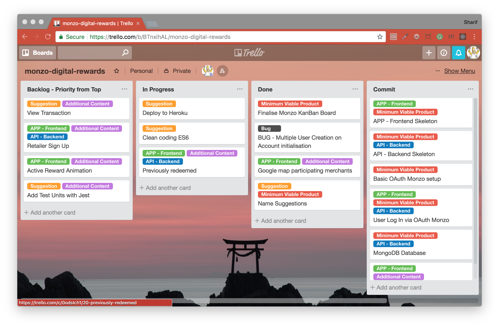
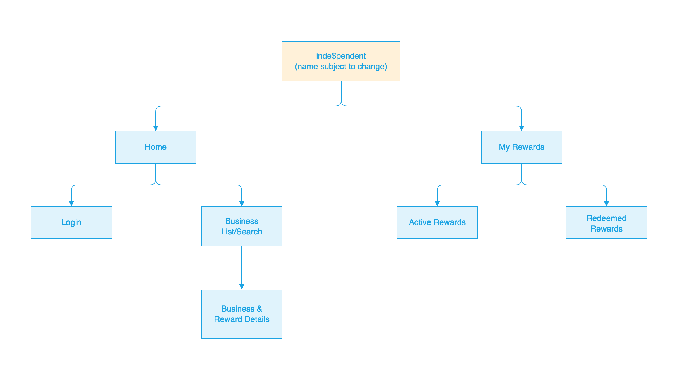
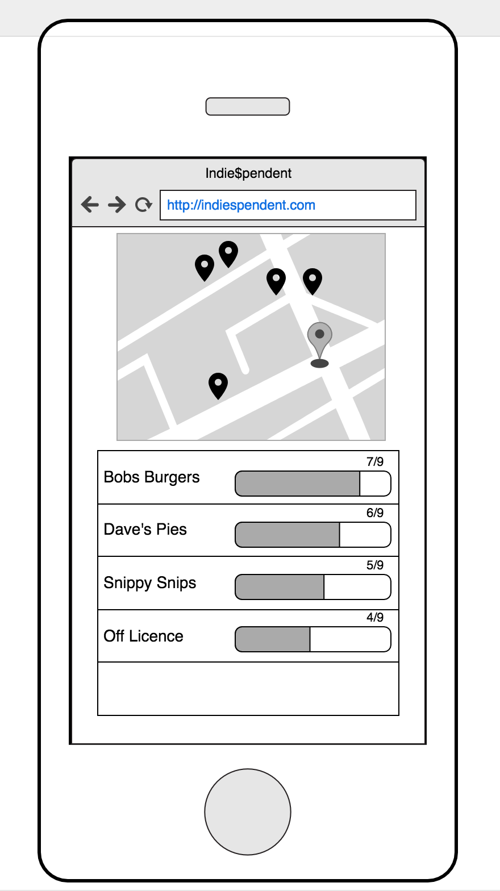

## Class Project (Planning) - Monzo Reward Web App

#### Useful Project Planning Links
* [Trello](https://www.trello.com) - Kanban project planning
* [Draw.io](https://www.draw.io) - Good for mapping out application flow/database relations
* [Moqups](https://moqups.com/) - Create blueprints of what your MVP should look like

#### Kanban Board

#### Flow for Reward Web App

#### Blueprint for Active Reward

[Return to README.md](../README.md)
