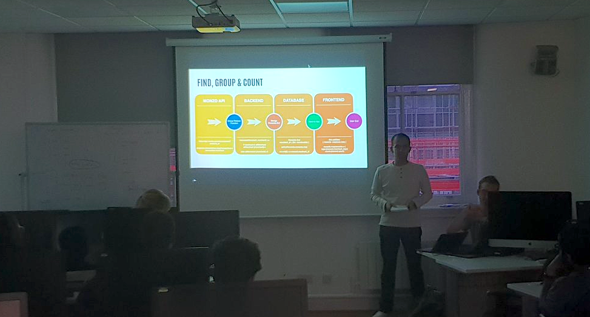

## Class Project (Introduction) - Monzo Reward Web App

Using Monzo API, build a web app using React called `Inde$pendent`. Inde$pendent will be a digital reward card that doesn’t require you to use apple or google pay at the checkout or scan some other type of card at the checkout. You don’t need to download a new app or change your preferred payment method at all. And through the utilization of Open Banking, all your transactions can be collated and count towards your reward goal.

<b>What is Open Banking</b>

Open Banking is an initiative designed to improve and enhance everyone’s banking experience. The core idea of Open Banking is that you can provide banks and other online providers with secure access to your account(s) so that you can manage your current accounts in a way that is better suited to your needs. If customers have multiple current accounts they will be able to see those accounts all in one place.

<b>Why Monzo</b>

Monzo is a digital bank built and run by a team of around 40 developers. We decided to use their API over other banks such as starling as their brand image suited what we wanted to achieve and it gave us the ability to use the features that we needed to make Inde$pendent work.

With Monzo, you receive a notification immediately after you make a transaction even before a receipt has been printed. This was another thing we liked about using Monzo and as we wanted our app to work in real time, something not possible if we had decided to work with a legacy bank.

<b>About the project</b>

Using Monzo API, create a web-based reward app which comprises three steps for the user, register, earn and redeem. Only the first and last step should require any user interaction. The user may want to check where their up to on the rewards bar or what offers are currently available but they shouldn’t have to scramble for a paper ticket or spend time loading an app just to ensure they earned 1/10th of a coffee.

It should also be easy and cost-effective for independent retailers to be on the same playing field as massive corporations. They shouldn’t have to install a new point of sale systems or higher advertising and marketing companies to start new campaigns. They should really just be able to sign up and pick a template reward scheme to gain access to our users.

[Return to README.md](../README.md)
