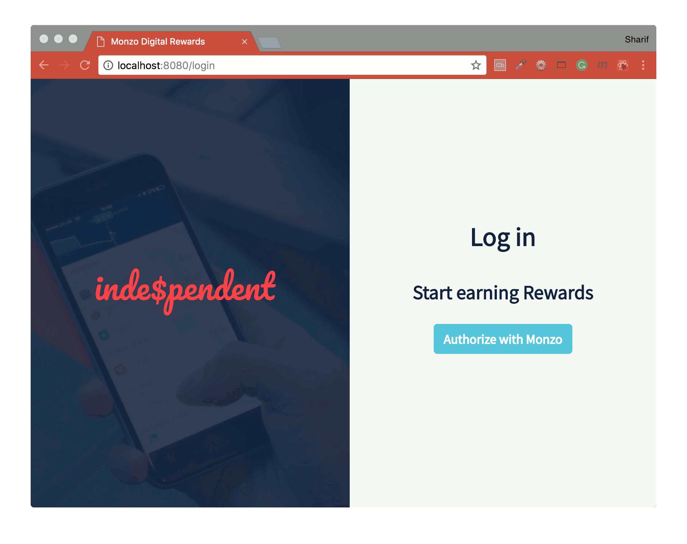

## Inde$pendent - Monzo Reward Web App

Class project with coding bootcamp [MCRcodes](https://github.com/MCRcodes), creating a web app for User rewards using [Monzo APi](https://developers.monzo.com/)

#### Team
- [Brad](https://github.com/bradlead)
- [Clover](https://github.com/cloverc)
- [Osman](https://github.com/SharifCoding)

#### Weekly Progress
- [Introduction](./Intro/README.md)
- [Planning](./Intro/PLANNING.md)
- [Week 0](./Week_0/README.md)
- [Week 1](./Week_1/README.md)
- [Week 2](./Week_2/README.md)
- [Week 3](./Week_3/README.md)
- [Week 4](./Week_4/README.md)
- [Final](./Final/README.md)
