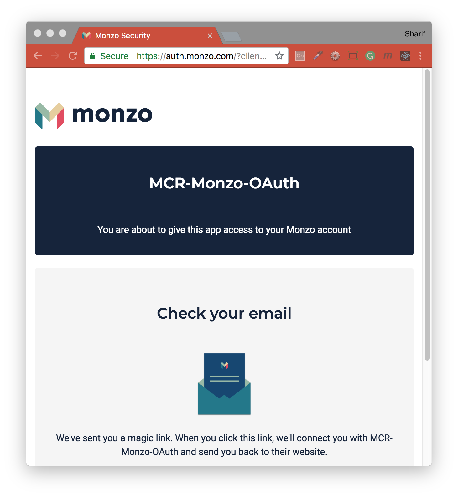

## Class Project (Week 0) - Monzo Reward Web App
A basic Web App with Login UAouth 2.0 access to Monzo API to pull a User list of accounts and transactions.



### Built-on:
- [Node.js](https://nodejs.org/en/) - Node Package Manager
- [Express](http://expressjs.com/) - Web application framework
- [Request](https://www.npmjs.com/package/request) - Simplest way possible to make http calls
- [dotenv](https://www.npmjs.com/package/dotenv) - Loads environment variables

#### Initial Setup for `oauthDetails`:
- Create new client database via Monzo developer portal
- Create `.env` file in the root `/` folder along side `package.json`
- Add `client_id`, `client_secret`, and `redirect_uri` to `.env` file
```bash
CLIENT_ID="your client id"
CLIENT_SECRET="your client secret"
REDIRECT_URL="http://localhost:3000/oauth/callback"
```
#### Running the App:
To run this project you will need to download it onto your local machine and install all dependencies.
Navigate inside the folders and install all dependencies and run the app by entering the following command on your terminal window:
```bash
# install dependencies
npm install
# launch app on localhost:3000
npm start
```
If you want to end the process hold `control` and press `c` in mac, if you are not using mac hold `ctrl` and press `c`.

#### Further Reading
- [Monzo for Developers](https://developers.monzo.com/)
- [OAuth 2 Simplified](https://aaronparecki.com/oauth-2-simplified/)
