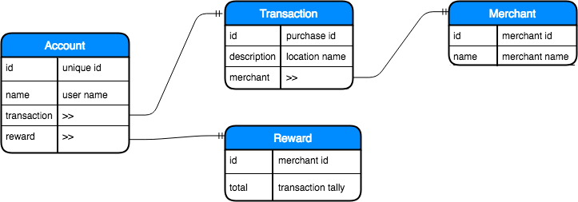
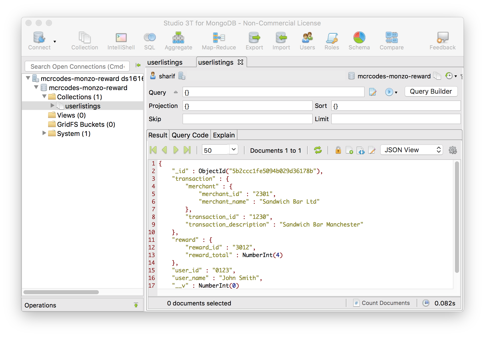

## Class Project (Week 1) - Monzo Reward Web App

#### Mapping Database Flow



#### Database Treeview
```bash
|-- user
    |-- user_id (Monzo accounts_id)
    |-- user_name (Monzo accounts_description)
    |-- transaction
    |   |-- transaction_id
    |   |-- transaction_description
    |   |-- merchant
    |       |-- merchant_id
    |       |-- merchant_name
    |-- reward
        |-- reward_id (unique id)
        |-- reward_merchant_id (matches with merchant_id)
        |-- reward_merchant_name (matches with merchant_name)
        |-- reward_redeem (boolean)
```

#### MongoDB User Listings



#### Further Reading
- [Introduction to Mongoose for MongoDB](https://medium.freecodecamp.org/introduction-to-mongoose-for-mongodb-d2a7aa593c57)
- [JSON Schema](https://restfulapi.net/json-schema/)
- [Rules of Thumb for MongoDB Schema Design](https://keon.io/mongodb-schema-design/)
- [Building a REST API using Mongo DB](https://codeburst.io/building-a-rest-api-using-mongo-db-75cac3403fab)
