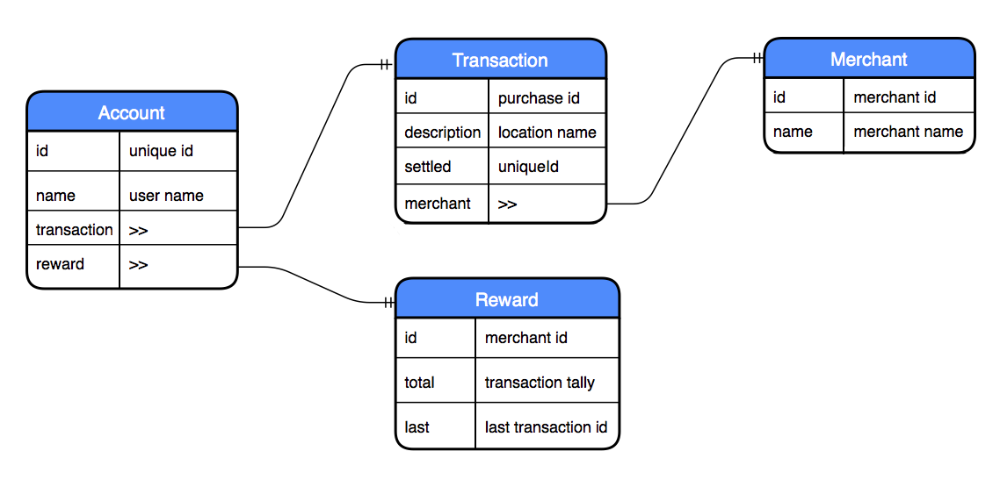

## Class Project (Week 1) - Monzo Reward Web App

#### Mapping Database Flow



#### MongoDB Schema
```js
// Account Schema
const accountSchema = new Schema({
  id: Number,
  name: String,
  transaction: {
    type: Schema.Types.ObjectId, ref: 'Transaction',
  },
  reward: {
    type: Schema.Types.ObjectId, ref: 'Reward',
  },
});

// Transaction Schema
const transactionSchema = new Schema({
  id: Number,
  description: String,
  settled: Number,
  merchant: {
    type: Schema.Types.ObjectId, ref: 'Merchant',
  },
});

// Merchant Schema
const merchantSchema = new Schema({
  id: Number,
  name: String,
});

// Reward Schema
const rewardSchema = new Schema({
  id: Number,
  total: Number,
  last: Number,
});
```
#### Further Reading
- [Rules of Thumb for MongoDB Schema Design](https://keon.io/mongodb-schema-design/)
- [Introduction to Mongoose for MongoDB](https://medium.freecodecamp.org/introduction-to-mongoose-for-mongodb-d2a7aa593c57)
