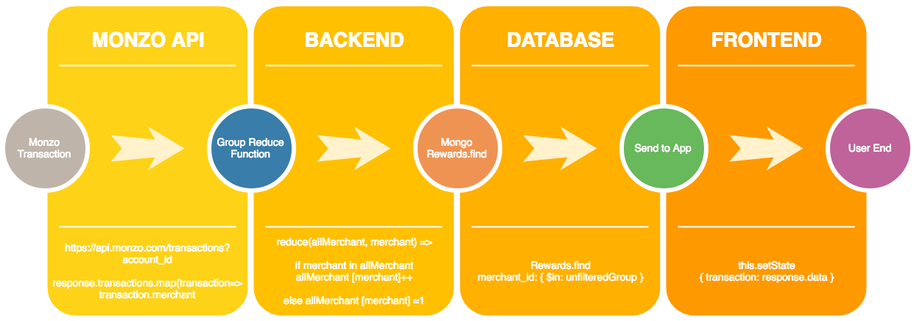

## Class Project (Week 4) - Monzo Reward Web App

### Reward Flow (Four Stages)



<b>Stage 1: Monzo API</b>
```js
request.get(`https://api.monzo.com/transactions?account_id=${accountID}`, {
  headers: { Authorization: `Bearer ${user.access_token}` },
})
.then((data) => {
  const response = JSON.parse(data);
  const reduceReward = groupMerchant(response.transactions.map(
    transaction => transaction.merchant,
));
```
<b>Stage 2: Backend API</b>
```js
merchant.reduce((allMerchantID, merchantName) => {
  if (merchantName in allMerchantID) {
    allMerchantID[merchantName]++;
  } else {
    allMerchantID[merchantName] = 1;
  }
  return allMerchantID;
}, {});
```
<b>Stage 3: Database</b>
```js
const merchantIds = merchants.map(merchant => merchant[0]);
return Rewards.find({ merchant_id: { $in: merchantIds }}).then((rewards) => {
  const activeRewards = rewards.map(reward => reward.toObject()).map((reward) => {
    const merchant = merchants.find(m => m[0] === reward.merchant_id);
    reward.count = merchant[1];
});
```
<b>Stage 4: Frontend APP</b>
```js
axios.get('http://127.0.0.1:3000/transaction')
  .then((response) => { this.setState({ rewards: response.data });
  })
render() {
  const { rewards } = this.state;
    return (
      <ul className="rewards rewards__list">
      {
      rewards.map(reward => (
      <Reward
        key={reward._id}
        description={reward.description}
        logo={reward.merchant_logo}
        count={reward.count}
      />
```

#### Further Reading
- [Array.prototype.reduce() - JavaScript](https://developer.mozilla.org/en-US/docs/Web/JavaScript/Reference/Global_Objects/Array/Reduce)
- [db.collection.find() - MongoDB Manual](https://docs.mongodb.com/manual/reference/method/db.collection.find/)
- [$in - MongoDB Manual](https://docs.mongodb.com/manual/reference/operator/query/in/)
- [Array.prototype.map() - JavaScript](https://developer.mozilla.org/en-US/docs/Web/JavaScript/Reference/Global_Objects/Array/map)

[Return to README.md](../README.md)
