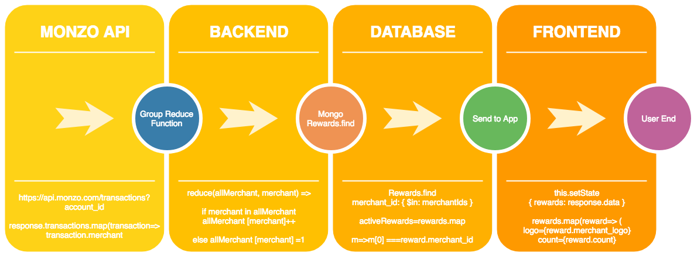

## Class Project (Week 4) - Monzo Reward Web App

#### Reward Flow

#### Further Reading
- [Array.prototype.reduce() - JavaScript](https://developer.mozilla.org/en-US/docs/Web/JavaScript/Reference/Global_Objects/Array/Reduce)
- [db.collection.find() - MongoDB Manual](https://docs.mongodb.com/manual/reference/method/db.collection.find/)
- [$in - MongoDB Manual](https://docs.mongodb.com/manual/reference/operator/query/in/)

[Return to README.md](../README.md)
